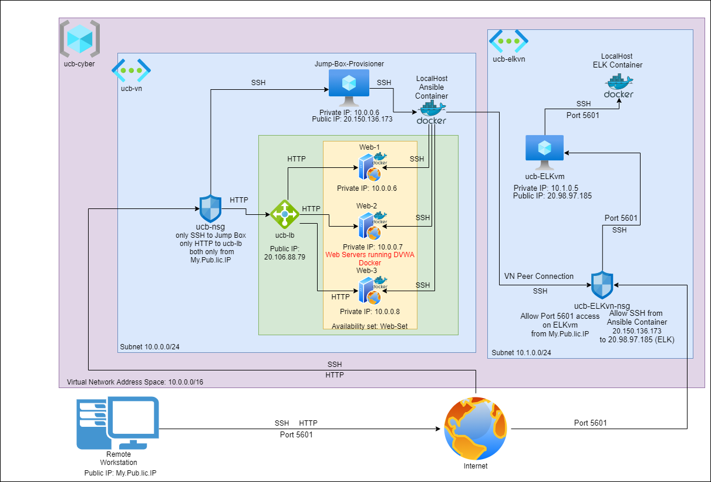
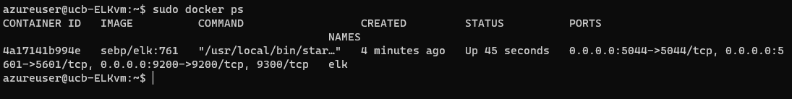

# BirdeeELKproject

## Automated ELK Stack Deployment

The files in this repository were used to configure the network depicted below.



The files in the included [ansible folder](ansible) have been tested and used to generate a live ELK deployment on Azure. They can be used to recreate the entire deployment pictured above. Alternatively, select playbooks in the [ansible/roles/](ansible/roles) directory (some of which have additional config files in [ansible/roles/files/](ansible/roles/files)) may be used to install only certain pieces of it, such as Filebeat.

This document contains the following details:
- Description of the Topology
- Access Policies
- ELK Configuration
  - Beats in Use
  - Machines Being Monitored
- How to Use the Ansible Build


### Description of the Topology

The main purpose of this network is to expose a load-balanced and monitored instance of DVWA, the D*mn Vulnerable Web Application.

Load balancing ensures that the application will be highly available, in addition to restricting access to the network.

Integrating an ELK server allows users to easily monitor the vulnerable VMs for changes to the logs and system metrics.

The configuration details of each machine may be found below:
| Name                 | Function     | Private IP Address | Public IP Address | Operating System    |
|----------------------|--------------|--------------------|-------------------|---------------------|
| Jump-Box-Provisioner | Gateway      | 10.0.0.5           | 20.150.136.173    | Linux               |
| ucb-lb               | Load Balancer| N/A                | 20.106.88.79      | Azure load balancer | 
| Web-1                | Web Server   | 10.0.0.6           | ucb-lb-back-pool  | Linux               |
| Web-2                | Web Server   | 10.0.0.7           | ucb-lb-back-pool  | Linux               |
| Web-3                | Web Server   | 10.0.0.8           | ucb-lb-back-pool  | Linux               |
| ucb-ELKvm            | ELK Server   | 10.1.0.5           | 20.98.97.185      | Linux               |

### Access Policies

The machines on the internal network are not exposed to the public Internet. 

Only the Jump Box machine can accept SSH connections from the Internet. This is the only connection type this machine will accept. Access to this machine is only allowed with the correct SSH key from the following IP addresses:
- My Home IP (public repository, didn't want to link it) IP may also access the Kibana Webpage._
  - _In theory, if the webservers were running an actual server, they would be open to the internet, but instead they are also only accessible from this IP because they are running DVWA, which is "D*mn Vulnerable"_
- Machines within the network can only be accessed by SSH from the ansible container on Jump-Box-Provisioner.

A summary of the access policies in place can be found in the table below:

| Name      | Publicly Accessible                              | From Source IPs                                        |
|-----------|--------------------------------------------------|--------------------------------------------------------|
| Jump Box  | SSH port 22 (RSA key authenticated, no password) | My Home IP (public repository, didn't want to link it) |
| ucb-ELKvm | port 5601 (for kibana dashboard)                 | My Home IP (public repository, didn't want to link it) |
| ucb-lb    | HTTP port 80 (load balancer for Web-{1-3})       | My Home IP (public repository, didn't want to link it) |
| Web-1     | no                                               |                                                        |
| Web-2     | no                                               |                                                        |
| Web-3     | no                                               |                                                        |

### Elk Configuration

Ansible was used to automate configuration of the ELK machine. No configuration was performed manually, which is advantageous because it allows us to easily create new, ready-to-run servers, either to increase capability to handle load, or recreate a working, monitored server structure in case data is lost or the machines are taken down.

The playbook implements the following tasks:
- Install docker.io
- Install pip3 (python3-pip)
- Install Docker python module using pip3
- Allocate the correct amount of memory for the vm
- download and launch a docker elk container (and set `restart_policy: always` so that when docker starts, it starts)
- Enable docker service on boot

The following screenshot displays the result of running `docker ps` after successfully configuring the ELK instance.



### Target Machines & Beats
This ELK server is configured to monitor the following machines:
- Web-1: 10.0.0.6
- Web-2: 10.0.0.7
- Web-3: 10.0.0.8

We have installed the following Beats on these machines:
- Filebeat
- Metricbeat

These Beats allow us to collect the following information from each machine:
- `Filebeat`: forwards and centralizes logs and files.
- `Metricbeat`: sends system and service statistics such as CPU and memory usage.

### Using the Playbook
In order to use the playbook, you will need to have an Ansible control node already configured. Assuming you have such a control node provisioned:

SSH into the control node and follow the steps below:
- Copy the desired playbook files from [ansible/roles/](ansible/roles) into `/etc/ansible/roles`, and any associated config files from [ansible/roles/files](ansible/roles/files) into `/etc/ansible/roles/files`.
  - This git repository (`git@github.com:BirdeeHub/BirdeeELKproject.git`) contains the playbooks:
    - `my-webserver-playbook.yml`
    - `ELK-playbook.yml`
    - `filebeat-playbook.yml`
      - requires `filebeat-config.yml`
    - `metricbeat-playbook.yml`
      - requires `metricbeat-config.yml`
  - `my-webserver-playbook.yml` installs DVWA on your webservers. If you do not wish to configure your servers to run DVWA, do not run it.
  - You must run `ELK-playbook.yml` for filebeat and metricbeat to be useful, as they send data to the machine configured by ELK-playbook.
- Update the `/etc/ansible/hosts` file to include the _**internal IPs**_ of the machines you wish to provision followed by `ansible_python_interpreter=/usr/bin/python3` to choose the interpreter. The IPs in the hosts file are under the titles `[webservers]` for the webservers and `[elk]` for the elk server, which are called upon in the playbooks to determine where to install the beat programs and the elk server stack respectively. 
  ```yml
  [webservers]
  10.0.0.6 ansible_python_interpreter=/usr/bin/python3
  10.0.0.7 ansible_python_interpreter=/usr/bin/python3
  10.0.0.8 ansible_python_interpreter=/usr/bin/python3
  #any other webservers you want to monitor or run DVWA on

  [elk]
  10.1.0.5 ansible_python_interpreter=/usr/bin/python3
  ```
  - Also be sure to update the `/etc/ansible/ansible.cfg` file to include the ssh username for ansible to use by uncommenting the following line and replacing root with the ssh username of the machines you wish to provision.
    ```yml
    # remote_user = root
    ``` 
    _if you use the ansible.cfg file in this git repository, this line will already be uncommented and have root already replaced by azureuser._

    ```yml
    remote_user = <SSH username used by your machines>
    ``` 
- If you wish to use the `filebeat` or `metricbeat` playbooks, you will need to update the IPs in the corresponding config files as follows:
  - `filebeat-config.yml` 
    ```yml
    output.elasticsearch:
      # Boolean flag to enable or disable the output module.
      #enabled: true

      # Array of hosts to connect to.
      # Scheme and port can be left out and will be set to the default (http and 9200)
      # In case you specify and additional path, the scheme is required: http://localhost:9200/path
      # IPv6 addresses should always be defined as: https://[2001:db8::1]:9200
      hosts: ["10.1.0.5:9200"] # TODO: Change this to the IP address of your ELK server
      username: "elastic"
      password: "changeme" # TODO: Change this to the password you set
    ```
    ```yml
    #============================== Kibana =====================================

    # Starting with Beats version 6.0.0, the dashboards are loaded via the Kibana API.
    # This requires a Kibana endpoint configuration.
    setup.kibana:
      host: "10.1.0.5:5601" # TODO: Change this to the IP address of your ELK server
    ```
  - `metricbeat-config.yml`
    ```yml
    #============================== Kibana =====================================

    # Starting with Beats version 6.0.0, the dashboards are loaded via the Kibana API.
    # This requires a Kibana endpoint configuration.
    setup.kibana:
      host: "10.1.0.5:5601"
    ```
    ```yml
    output.elasticsearch:
      # Array of hosts to connect to.
      hosts: ["10.1.0.5:9200"]
      username: "elastic"
      password: "changeme"
    ```
- Run the playbook with 
  ```bash
  ansible-playbook <the playbook you wish to run>
  ```
  Then, assuming you have already run `ELK-playbook.yml`, navigate to http://20.98.97.185:5601/app/kibana#/home to check that the installation worked as expected. (20.98.97.185 is my ELK server public IP. Replace it with yours.)
